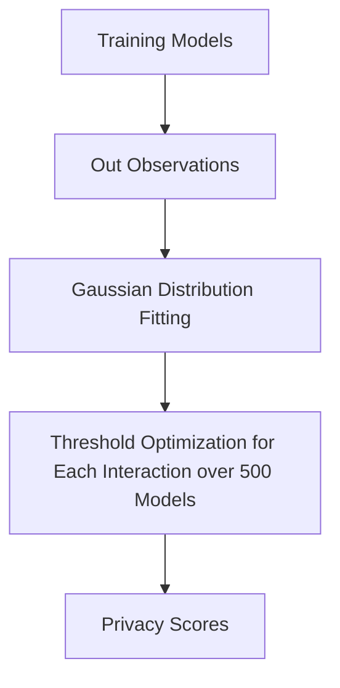

Here's an optimized version of your README introduction with improved clarity, structure, and professional tone:

---

# RecLiRA: Recommendation-specific Likelihood Ratio Attack

**A Privacy Attack Framework for Recommendation Systems**

**Before Starting**

Please download Amazon-beauty and Music dataset from official websites to `./RecLiRA/contents/` as the screenshot in the `./RecLiRA/contents/`.

## 🚀 Quick Start: Two choices

**1. Run Attack Evaluation on a single model**  
```bash
./RecLiRA/run_attack.sh
```

**2. Generate Privacy Scores**  
```bash
./RecLiRA/run_score.py
```
*Default configuration*: Trains 500 Neural Collaborative Filtering (NCF) models on ML-1M dataset

---

## 🔍 Workflow Overview

### Pipeline Architecture


### Key Components
1. **Model Training**  
   - Shadow models: `./RecLiRA/shadow-models/`
   - Target models: `./RecLiRA/target-models/`

2. **Observation Storage**  
   - Item-level data: `./RecLiRA/item-data/shadow/`, `./RecLiRA/item-data/target/`

3. **Statistical Analysis**  
   - Gaussian distribution generation: `./RecLiRA/distribution/`
   - Threshold optimization: `./RecLiRA/results/`

4. **Score Calculation**  
   - User-level scores derived from interaction average
   - Final results: `./RecLiRA/results/`

---

## 📄 Implementation Notes

### Core Methodology
Our paper results exclusively use **interaction-level LiRA** that:
- Follows rigorous mathematical analysis
- Provides theoretically grounded privacy measurements
- Ensures reproducible evaluation standards

### Experimental Caution
While we provide a user-level LiRA implementation in `./RecLiRA/train_user.py` please note:
```diff
+ This variant demonstrates competitive performance (particularly at low FPR)
- Not formally analyzed in our paper
- Considered an empirical extension
- Users assume full responsibility for results derived from this method
- User-level LiRA was not used in the paper's experimental results generation.
```

The user-level implementation aggregates interaction log-odds through:
1. Observation summation
2. Mean value calculation
3. Out-distribution generation
4. Score estimation

---

## 🔬 Reproducibility Commitment
We officially support and guarantee reproducibility for:
- All interaction-level LiRA results
- Default experimental configurations
- Core pipeline components

For custom implementations/extensions:
```warning
While we provide baseline implementations for alternative approaches, 
reproducers must independently validate results from non-core methodologies.
```

---


